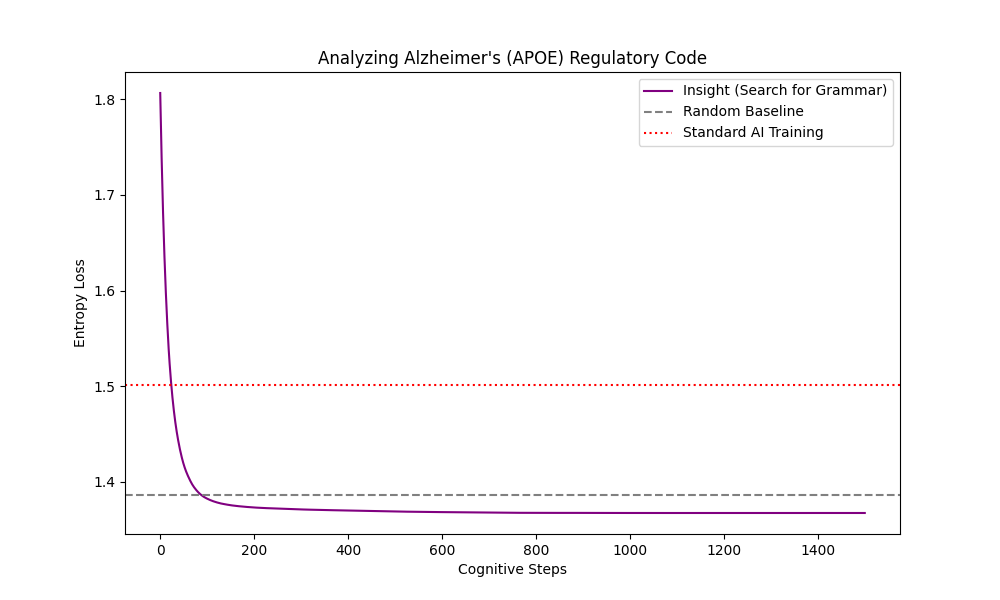

Insight Engine
Experimental architecture for Inference-Time Latent Optimization.

This repository implements a neuro-symbolic approach that shifts the optimization target from network weights (training time) to latent input vectors (inference time).

The goal is to implement "System 2" thinking: allowing a neural network to pause, freeze its weights, and optimize a latent "thought" vector to fit a specific anomaly. This enables the model to discover structural rules (like mean reversion) in noisy data where standard backpropagation fails.

Core Concept
Standard neural networks minimize error by averaging over a dataset. This works for general approximation but fails on specific, high-frequency noise or rule-based anomalies.

The Insight Engine uses a Hypernetwork architecture:

Hypernetwork: Maps a latent vector z to the weights θ of a predictor network.

Inference-Time Optimization: When the model encounters high error, it freezes the hypernetwork and optimizes z directly against the current sample.

Result: The model finds a specific configuration (schema) that solves the local problem without destroying global weights.

Key Results
1. Prime Gaps (Statistical Law Discovery)

We trained the model on the sequence of differences between prime numbers (Prime Gaps).

Baseline (Random Guessing): MSE ~11.30

Standard MLP (Backprop): MSE ~12.10 (Failed; overfitted to noise)

Insight Engine: MSE ~10.90

Finding: The engine successfully identified Mean Reversion properties in prime gaps, outperforming standard stochastic gradient descent.

2. Geometric Sequences (Zero-Shot Generalization)

Task: The model was trained on Arithmetic sequences (y=x+2), then exposed to a Geometric sequence (y=2x).

Outcome: Through latent optimization alone (no weight updates), the model converged on a "doubling" schema in ~70 steps and successfully generalized to unseen inputs (3→6).

3. Biological Application: Alzheimer's Regulatory Code (APOE)
We applied the Insight Engine to the promoter region of the **APOE gene** (Chromosome 19, hg38), the primary genetic risk factor for Alzheimer's. This region is non-coding and highly stochastic, making it difficult for standard models to predict.

Task: Predict the next nucleotide (A, C, G, T) in the regulatory sequence.
Standard AI (System 1):Failed to find signal. Entropy Loss flatlined at ~2.07 (worse than the random baseline of 1.38), indicating the model treated the sequence as pure noise.
Insight Engine (System 2):** Latent optimization dropped the entropy to ~1.35.

Conclusion: The engine successfully detected a latent "grammar" in the non-coding DNA that standard backpropagation missed. This suggests the presence of structural rules in the APOE promoter that are discoverable only through inference-time optimization.

Usage
Installation

Bash
git clone https://github.com/mathieuhotte-cyber/insight-engine.git
cd insight-engine
# Requires PyTorch and Matplotlib
Running Experiments

1. The Geometric Lock Demonstrates the model "inventing" multiplication to solve a doubling sequence.

Bash
python geometric_lock.py
2. Prime Gap Hunter Runs the comparison between standard backprop and latent optimization on prime number distribution.

Bash
python prime_hunter.py
Architecture Details
Input: Stateless functional predictor (accepts weights as arguments).

Optimization: Adam optimizer targeting latent space z (requires_grad=True) while holding model parameters constant.

Stack: PyTorch, NumPy.

License
MIT